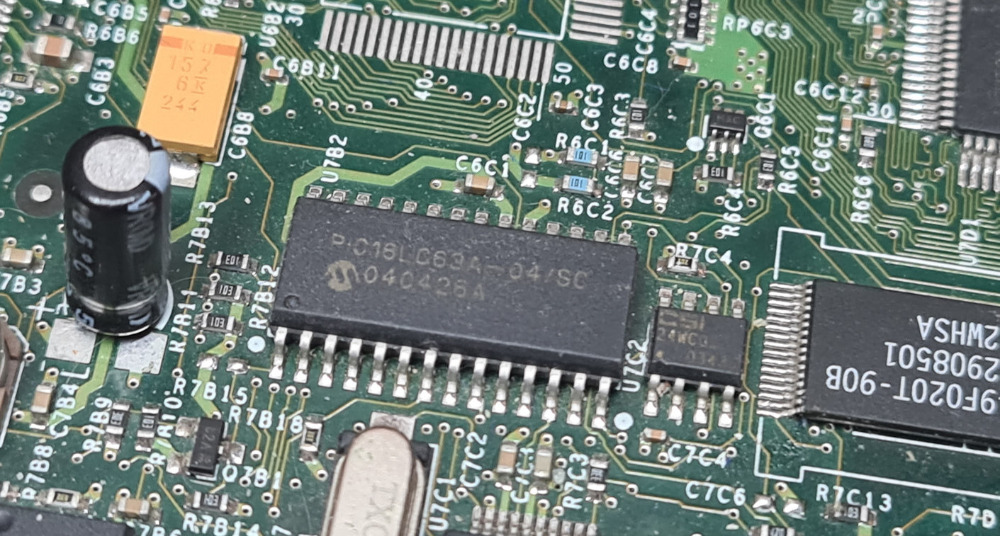

# Xbox_SMC
PIC16 dumps from the original Xbox and IDA databases with some reverse engineering done.

# Dumps
The .bin file for each dump has the bytes swapped for correct loading into IDA. So the first word of PIC memory is byte_0 + byte_1 << 8.

The .idb IDA databases have info about variable and some observations on the database notepad.

See this wiki page for a breakdown of the SMC versions: https://xboxdevwiki.net/Xboxen_Info

## P01
Dumped from a v1.0 Xbox. The config word is 0x86:
- CP1:CP0 = 0 (Code Protection enabled for the whole memory)
- BODEN = 0 (Brown-out Reset disabled)
- ~PWRTE = 0 (Power-up Timer enabled)
- WDTE = 1 (Watchdog Timer enabled)
- FOSC1:FOSC0 = 2 (HS oscillator)

A config value of 0x3FB6 is suitable for SMC clones so that they don't have code protection enabled.

## P11
Dumped from a v1.3 Xbox. Same config word as P01.

There are a few small changes in P11 versus P01 including an extra SMBus command (write 0x22), different LED priorities, and more relaxed timings for boot.

I checked scrambled dumps of v1.3 against v1.4 and they matched. This means it's highly likely they have the same program.

# Dumping methodology
I don't want to reveal all the details yet, so here is the vague outline on how I dumped the PIC.

The PIC has its code protection enabled so all the data reads as 0000. I used some trick to get scrambled data output instead, discovered the scrambling algorithm using a sacrificial chip, and then used a kind of exploit to change the ROM data to fix some bits to known values. Then I can extract the required information from the multiple scrambled dumps to rebuild the original data.

# PICProgrammer
PICProgrammer is one of a few Arduino projects for the RP2040 that I used in my research. It provides a simple command-line interface to execute ICSP (in-circuit serial programming) operations on the PIC. This is favoured over using a purpose-build programmer such as the PICkit due to its flexibility and the option of doing things that the manufacturer didn't intend.

You should have a good understanding of electronics and programming before using this, and take a good look over what commands do before executing them.
